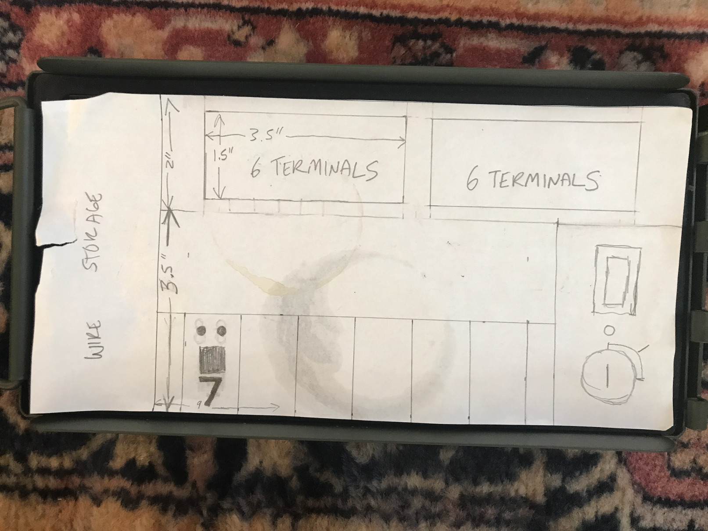

I have ordered up a bunch of parts and have started to map out my design. I think the whole project will cost about $100. The first thing I did was a quick scale sketch on a piece of paper, and then I started to work on my design using tinkercad and my digital caliper.

I think I want to design an insert for a .50 Cal ammo box that will cover the lead acid battery and allow for storage of the wiring on the side of the can.  I will also need a box to hold the battery in the ammo box.  I decided to use an ammo box because of the weight of the sealed lead acid battery and the easy availability and nice waterproof seal available on ammo cans.

After some quick measurements it seems that everything I want to use should fit nicely.

I want to have a key switch to activate the whole unit, and a rocker switch and LED's for Test and Armed modes once the key switch is activated.

